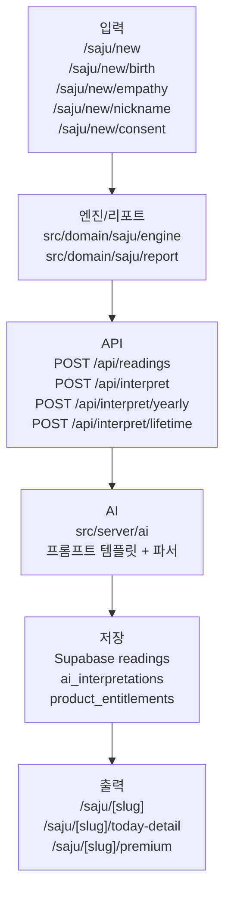
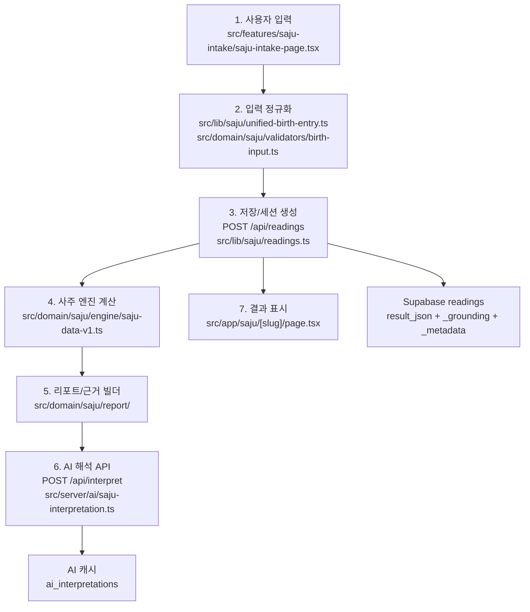

# Saju Pipeline Schema And Trace

작성일: 2026-05-08  
기준 커밋: `235cd81`  
대상 흐름: 사주 입력 → 계산 → 리포트 컨텍스트 → AI 풀이 → 저장/캐시 → 결과 표시

이 문서는 사주풀이가 “왜 개인화되지 않는지”, “어디서 같은 문장이 반복되는지”, “출생지/시간/성별이 어디서 사라지는지”를 추적하기 위한 7단계 파이프라인 스키마입니다.

## 0. 핵심 파일 연결 스키마

사주풀이 파이프라인은 크게 보면 5개 레이어가 직렬로 이어지는 구조입니다.
문제가 생겼을 때는 아래 순서로 “입력값이 어디까지 살아 있는지”를 확인합니다.

### 0.1 입력 레이어

- 화면 경로
  - `/saju/new`
  - `/saju/new/birth`
  - `/saju/new/empathy`
  - `/saju/new/nickname`
  - `/saju/new/consent`
- 실제 구현 중심 파일
  - `src/features/saju-intake/saju-intake-page.tsx`
  - `src/app/saju/new/page.tsx`
  - `src/app/saju/new/birth/page.tsx`
  - `src/app/saju/new/empathy/page.tsx`
  - `src/app/saju/new/nickname/page.tsx`
  - `src/app/saju/new/consent/page.tsx`
- 주요 전달값
  - 생년월일
  - 출생시/출생분/시간 모름 여부
  - 성별
  - 출생지 label/code/latitude/longitude
  - 양력/음력
  - 시간 규칙
  - 관심사 topic
  - 이름 또는 nickname

### 0.2 엔진/리포트 레이어

- 계산 엔진
  - `src/domain/saju/engine/`
  - `src/lib/saju/pillars.ts`
- 리포트 빌더
  - `src/domain/saju/report/build-report.ts`
  - `src/domain/saju/report/build-grounding.ts`
  - `src/domain/saju/report/personalization-context.ts`
  - `src/domain/saju/report/punch-copy.ts`
- 핵심 출력
  - 년주/월주/일주/시주
  - 일주 코드와 60갑자 특성
  - 오행 비율
  - 십성 분포
  - 강약 판단
  - 용신/희신/기신
  - 대운/세운/월운
  - 화면용 `SajuReport`
  - AI용 `SajuInterpretationGrounding`

### 0.3 API 레이어

- 저장/생성
  - `src/app/api/readings/route.ts`
  - `src/lib/saju/readings.ts`
- 기본 AI 풀이
  - `src/app/api/interpret/route.ts`
- 연간 풀이
  - `src/app/api/interpret/yearly/route.ts`
- 평생/프리미엄 풀이
  - `src/app/api/interpret/lifetime/route.ts`
- 진단 포인트 1
  - `/api/interpret`가 `resolveReading()`으로 가져온 `sajuData`, `report`, `grounding.personalizationContext`를 실제 프롬프트에 넣고 있는지 확인합니다.

### 0.4 AI 레이어

- 주요 파일
  - `src/server/ai/saju-interpretation.ts`
  - `src/server/ai/saju-yearly-interpretation.ts`
  - `src/server/ai/saju-lifetime-interpretation.ts`
  - `src/server/ai/openai-text.ts`
- 진단 포인트 2
  - `createInterpretationPrompt()`의 input 안에 생년월일만 있는지, 아니면 일주/오행/십성/강약/용신/대운까지 들어가는지 확인합니다.
  - Phase 2~4 기준으로 기본 풀이 프롬프트에는 `personalizationContext`, `factJson`, `evidenceJson`이 함께 들어갑니다.
  - 출력 반복이 의심되면 `scripts/compare-saju-output-similarity.mjs`로 두 입력의 프롬프트 유사도를 먼저 확인합니다.

### 0.5 저장/권한/출력 레이어

- 저장
  - Supabase `readings`
  - Supabase `ai_interpretations`
  - Supabase `product_entitlements`
- 권한/결제 체인
  - `src/lib/product-entitlements.ts`
  - `src/lib/report-entitlements.ts`
  - `src/lib/credits/`
  - `src/app/api/payments/confirm/route.ts`
- 출력
  - `src/app/saju/[slug]/page.tsx`
  - `src/app/saju/[slug]/today-detail/page.tsx`
  - `src/app/saju/[slug]/premium/page.tsx`
- 진단 포인트 3
  - 같은 slug/reading id가 재사용되면서 예전 결과를 반환하는지 확인합니다.
  - UUID reading은 `readings.result_json`과 `ai_interpretations` 캐시를 확인합니다.
  - deterministic slug는 `toSlug()`/`fromSlug()`가 출생시간, 성별, 위치, hash token을 제대로 반영하는지 확인합니다.

## 1. 전체 연결도

## 2. 7단계 파이프라인

### [1] 사용자 입력

- 주요 파일
  - `src/features/saju-intake/saju-intake-page.tsx`
  - `src/components/saju/shared/unified-birth-info-fields.tsx`
  - `src/features/saju-intake/onboarding-storage.ts`
- 현재 전달값
  - `calendarType`
  - `timeRule`
  - `year`
  - `month`
  - `day`
  - `hour`
  - `minute`
  - `unknownBirthTime`
  - `gender`
  - `birthLocationCode`
  - `birthLocationLabel`
  - `birthLatitude`
  - `birthLongitude`
  - `focusTopic`
  - `nickname`
- 실제 제출 경로
  - `submit()`에서 `resolveUnifiedBirthInput()` 호출
  - 성공 시 `POST /api/readings`
  - 응답으로 받은 `data.id`를 결과 slug/id로 사용
- 체크포인트
  - 입력 폼에서 출생지 label/code/lat/lon이 모두 들어오는지 확인
  - `timeRule === trueSolarTime`일 때 `solarTimeMode`가 `longitude`로 바뀌는지 확인
  - 로그인 사용자는 `/api/profile`에도 birth 정보가 저장되는지 확인

### [2] 입력 정규화

- 주요 파일
  - `src/lib/saju/unified-birth-entry.ts`
  - `src/domain/saju/validators/birth-input.ts`
- 역할
  - 양력/음력 입력을 엔진용 `BirthInput`으로 변환
  - 음력은 `Lunar.fromYmd(...).getSolar()`로 양력 날짜로 변환
  - `timeRule`을 `jasiMethod`, `solarTimeMode`로 변환
  - 출생지 code/label/좌표를 `BirthInput.birthLocation`으로 정규화
- 출력 타입
  - `BirthInput`
- 현재 보존되는 값
  - 생년월일
  - 출생시간/분
  - 시간 모름 여부
  - 성별
  - 출생지 label/code/lat/lon/timezone
  - `solarTimeMode`
  - `jasiMethod`
- 위험 지점
  - 음력 원본 날짜 자체는 `BirthInput`에 남지 않고, 양력 변환 결과만 엔진으로 넘어감
  - custom location label은 slug 복원 시 완전히 보존되지 않을 수 있음

### [3] 저장/세션 생성

- 주요 파일
  - `src/app/api/readings/route.ts`
  - `src/lib/saju/readings.ts`
  - `src/lib/saju/pillars.ts`
- API
  - `POST /api/readings`
- 역할
  - 입력을 검증한 뒤 Supabase `readings`에 저장
  - Supabase 저장이 불가능하면 deterministic slug를 preview id로 반환
- 두 가지 결과 ID
  - UUID reading id
    - DB 저장 성공
    - 예: `/saju/67cd1e38-c80d-41a7-ba43-8c408e3aa1f3`
  - deterministic slug
    - DB 저장 실패 또는 preview
    - 예: `/saju/1982-1-29-8-m45-male-locseoul-solarlongitude`
- 저장 payload
  - `birth_year`
  - `birth_month`
  - `birth_day`
  - `birth_hour`
  - `gender`
  - `result_json`
- `result_json` 안에 들어가는 값
  - `SajuDataV1`
  - `_grounding`
  - `_kasiComparison`
  - `_metadata`
- 위험 지점
  - DB column에는 `birth_minute`, `birth_location`이 직접 컬럼으로 저장되지 않음
  - 대신 `result_json.input` 안에 저장됨
  - 과거 row나 손상 row에서 `result_json.input`이 없으면 위치/분 정보가 fallback에서 사라질 수 있음
  - preview slug는 custom location 표시명이 `직접 입력 지역`으로 복원될 수 있음

### [4] 사주 엔진 계산

- 주요 파일
  - `src/domain/saju/engine/saju-data-v1.ts`
  - `src/lib/saju/pillars.ts`
  - `src/lib/saju/birth-location.ts`
  - `src/domain/saju/engine/orrery-adapter.ts`
- 핵심 함수
  - `calculateSajuDataV1(input)`
  - 내부에서 `calculateSaju(input)` 호출
- 출력 타입
  - `SajuDataV1`
- 주요 출력
  - 년/월/일/시 간지
  - 일간
  - 오행 분포
  - 십성
  - 강약
  - 격국
  - 용신/희신/기신 후보
  - 대운/세운/월운
  - 합충/공망/신살 등 보조 정보
  - 입력 스냅샷과 계산 metadata
- 체크포인트
  - `sajuData.input.location`
  - `sajuData.input.birthTimeCorrection`
  - `sajuData.pillars.hour`
  - `sajuData.fiveElements`
  - `sajuData.tenGods`
  - `sajuData.currentLuck`
- 위험 지점
  - `unknownTime`이면 시주가 비어 있으므로 시주 기반 풀이를 강하게 쓰면 안 됨
  - 출생지 경도 보정이 들어왔는지 `metadata`와 `input.birthTimeCorrection`에서 확인 필요

### [5] 리포트/근거 빌더

- 주요 파일
  - `src/domain/saju/report/build-report.ts`
  - `src/domain/saju/report/build-grounding.ts`
  - `src/domain/saju/report/interpretation-rule-table.ts`
  - `src/domain/saju/report/topic-rule-table.ts`
  - `src/domain/saju/report/punch-copy.ts`
- 핵심 함수
  - `buildSajuReport(input, sajuData, topic)`
  - `buildSajuInterpretationGrounding(input, sajuData, report)`
  - `buildPunchReading(report)`
- 출력
  - 화면용 `SajuReport`
  - AI용 `SajuInterpretationGrounding`
  - 간단 결과용 punch copy
- AI에 넘길 컨텍스트
  - `factJson`
    - birth input
    - calendar conversion
    - pillars
    - dayMaster
    - fiveElements
    - tenGods
    - strength
    - pattern
    - yongsin
    - luckCycles
    - relations
    - metadata
  - `evidenceJson`
    - primaryConcept
    - strength
    - pattern
    - yongsin
    - luckFlow
    - relations
    - classics cards
- 체크포인트
  - `factJson.birthInput.birthLocationLabel`
  - `factJson.pillars`
  - `factJson.fiveElements`
  - `factJson.tenGods`
  - `evidenceJson.luckFlow`
  - `evidenceJson.classics.cards`
- 위험 지점
  - 화면용 짧은 결과는 `buildPunchReading(report)` 중심이라 AI를 거치지 않음
  - 반복 문장이 나오면 우선 `build-report.ts`, `punch-copy.ts`, `public-copy.ts`를 확인해야 함
  - AI 결과의 반복이면 `createInterpretationPrompt()`와 fallback builder를 확인해야 함

### [6] AI 해석 API

- 주요 파일
  - `src/app/api/interpret/route.ts`
  - `src/server/ai/saju-interpretation.ts`
  - `src/server/ai/openai-text.ts`
- API
  - `POST /api/interpret`
- 요청값
  - `readingId`
  - `topic`
  - `regenerate`
  - `counselorId`
- 처리 순서
  - `resolveReading(readingId)`
  - `buildSajuReport(reading.input, reading.sajuData, topic)`
  - `buildSajuInterpretationGrounding(...)`
  - `buildFallbackInterpretation(...)`
  - `createInterpretationPrompt(...)`
  - `generateAiText(...)`
  - `parseInterpretationText(...)`
  - OpenAI 성공 시 `ai_interpretations`에 캐시
- 프롬프트 개인화 여부
  - `factJson`과 `evidenceJson` 전체가 프롬프트 input으로 들어감
  - 프롬프트는 내부용어를 본문에 직접 쓰지 말라고 지시함
- 캐시 조건
  - UUID reading id일 때만 `cacheable = true`
  - deterministic slug는 `cacheable = false`
- 캐시 key
  - `reading_id`
  - `topic`
  - `prompt_version`
- 위험 지점
  - UUID가 아닌 slug 결과는 AI 캐시를 타지 않음
  - 같은 UUID + topic + prompt_version이면 cached response가 재사용됨
  - 사용자가 재생성을 원하면 `regenerate: true` 필요
  - AI가 실패하면 fallback 해석으로 내려감

### [7] 결과 표시

- 주요 파일
  - `src/app/saju/[slug]/page.tsx`
  - `src/app/saju/[slug]/today-detail/page.tsx`
  - `src/app/saju/[slug]/premium/page.tsx`
  - `src/features/saju-detail/saju-screen-nav.tsx`
- 무료 결과 화면 처리
  - `resolveReading(slug)`
  - `buildSajuReport(input, sajuData, topic)`
  - `buildPunchReading(report)`
  - 오행/분야별 짧은 카드 표시
  - `today-detail` 구매 여부 확인 후 CTA 분기
- 현재 무료 결과 화면 특징
  - AI API를 호출하지 않음
  - 계산값 기반의 짧은 요약만 표시
  - `today-detail` 결제/구매한 풀이 열기 경로로 이동
- 위험 지점
  - “무료 결과가 너무 일반적”이면 AI 문제가 아니라 `buildPunchReading`, `buildSajuReport` 문제일 가능성이 큼
  - “출생 지역 미입력”은 `formatBirthSummary(input)`에서 `input.birthLocation?.label`이 없을 때 표시됨
  - UUID reading인데도 location이 없으면 DB 저장/복원 단계 문제
  - deterministic slug인데 location label이 달라지면 `toSlug/fromSlug` 복원 한계 문제

## 3. 캐시/저장 구조

### 3.1 readings

- 생성 위치
  - `src/lib/saju/readings.ts`
- 생성 함수
  - `createReading(input, userId)`
- 저장 데이터
  - 기본 birth column 일부
  - `result_json`
- `result_json`에 포함되는 핵심 데이터
  - 계산 결과 전체
  - grounding
  - metadata
- 재조회 함수
  - `resolveReading(identifier)`
  - UUID면 DB 조회
  - slug면 `fromSlug()` 후 재계산

### 3.2 ai_interpretations

- 생성 위치
  - `src/app/api/interpret/route.ts`
- 저장 조건
  - OpenAI source일 때
  - UUID reading id일 때
- key
  - `reading_id`
  - `topic`
  - `prompt_version`
- 주의
  - deterministic slug에는 캐시 저장하지 않음
  - prompt version이 안 바뀌면 예전 문체가 계속 나올 수 있음

### 3.3 product entitlement

- 관련 파일
  - `src/lib/product-entitlements.ts`
  - `src/lib/saju/today-detail-access.ts`
  - `src/lib/saju/today-detail-links.ts`
  - `src/app/api/payments/confirm/route.ts`
- 역할
  - 550원/990원 상품 구매 여부 확인
  - 이미 구매한 경우 다시 결제하지 않고 상세 페이지로 이동

## 4. 문제 추적 체크리스트

### 4.1 출생지가 사라지는 경우

- [ ] `saju-intake-page.tsx` submit 직전 form에 `birthLocationLabel`, `birthLatitude`, `birthLongitude`가 있는가
- [ ] `resolveUnifiedBirthInput()` 결과 `parsed.input.birthLocation`이 있는가
- [ ] `/api/readings` 응답이 UUID인가 preview slug인가
- [ ] UUID라면 `readings.result_json.input.location`이 있는가
- [ ] slug라면 `toSlug()`에 `loc...` 또는 `loccustom/lat/lon`이 포함되는가
- [ ] `fromSlug()` 복원 후 `input.birthLocation.label`이 있는가
- [ ] `/saju/[slug]/page.tsx`의 `formatBirthSummary(input)`에서 label을 받는가

### 4.2 AI 풀이가 개인화되지 않는 경우

- [ ] 요청 readingId가 UUID인가 deterministic slug인가
- [ ] `/api/interpret` 요청에 topic이 들어가는가
- [ ] `resolveReading(readingId)`가 실제 reading을 찾는가
- [ ] `grounding.factJson.birthInput`에 입력값이 살아 있는가
- [ ] `grounding.factJson.pillars`가 개인별로 다른가
- [ ] `grounding.evidenceJson`이 topic별로 달라지는가
- [ ] cached response가 반환되는가
- [ ] `regenerate: true`가 필요한 상황인가
- [ ] OpenAI 실패로 fallback이 나온 것은 아닌가

### 4.3 같은 문장이 반복되는 경우

- [ ] 무료 결과인지 AI 결과인지 먼저 구분
- [ ] 무료 결과면 `buildPunchReading()`과 `buildSajuReport()` 확인
- [ ] 오늘 상세면 `src/app/saju/[slug]/today-detail/page.tsx`와 관련 builder 확인
- [ ] AI 결과면 `createInterpretationPrompt()`와 `buildFallbackInterpretation()` 확인
- [ ] `ai_interpretations` 캐시가 오래된 prompt_version으로 남아 있는지 확인

### 4.4 결제 후에도 상세가 바로 안 열리는 경우

- [ ] checkout URL에 `product=today-detail`과 `slug`가 있는가
- [ ] `/api/payments/confirm`에서 product entitlement가 저장되는가
- [ ] `getSajuTodayDetailEntitlement(slug)`가 true를 반환하는가
- [ ] `/membership/success`가 `/saju/[slug]/today-detail`로 보내는가
- [ ] `/saju/[slug]` CTA가 이미 구매 시 `buildSajuTodayDetailHref(slug)`를 쓰는가

## 5. 현재 구조상 우선 점검해야 할 끊김 후보

1. 출생지 표시명 보존
   - custom location은 slug 복원 시 표시명이 `직접 입력 지역`으로 바뀔 수 있음
   - DB 저장 row에서는 `result_json.input.location`이 살아 있어야 함

2. preview slug와 UUID 흐름 차이
   - UUID는 DB 저장/AI 캐시 가능
   - slug는 재계산 중심이며 AI 캐시는 하지 않음

3. 무료 결과와 AI 결과의 분리
   - `/saju/[slug]` 무료 결과는 AI 호출 없이 report builder 기반
   - AI 문체 문제가 아닌데 AI 프롬프트만 고치면 화면이 안 바뀔 수 있음

4. 오래된 AI 캐시
   - UUID + topic + prompt_version이 같으면 기존 AI 결과가 다시 나옴
   - 프롬프트를 바꿨다면 prompt version 변경 또는 regenerate가 필요

5. birth column과 result_json 불일치
   - `readings` 테이블 기본 column에는 일부 정보만 있음
   - 실제 정밀 정보는 `result_json`에 의존함
   - legacy row는 위치/분/보정 정보가 부족할 수 있음

## 6. 우선순위 가설 점검 결과

### 6.1 1순위 가설: AI 프롬프트에 개인화 데이터가 안 들어간다

현재 코드 기준으로 `/api/interpret`에는 아래 데이터가 OpenAI input에 들어갑니다.

- `factJson.birthInput`
  - 생년월일
  - 시간/분
  - 성별
  - 출생지 label/code/lat/lon
  - 표준시/경도 보정
  - 시간 보정 minutes
- `factJson.pillars`
  - 년주/월주/일주/시주
  - 각 간지
  - stem/branch element
  - 십성
  - 지장간
- `factJson.fiveElements`
  - 오행별 count/score/percentage/state
- `factJson.tenGods`
  - 십성 분포
- `factJson.strength`
  - 강약 level/score/rationale
- `factJson.pattern`
  - 격국 정보
- `factJson.yongsin`
  - 용신/희신/기신 후보
- `factJson.luckCycles`
  - 대운/세운/월운
- `evidenceJson`
  - AI가 참고할 요약 카드, 용신 후보, 운 흐름, 관계 흐름

로컬 비교 결과, 전혀 다른 두 사주의 prompt payload는 다음 값이 실제로 다르게 들어갑니다.

- 일주
  - 예시 A: `壬子`
  - 예시 B: `丁丑`
- 오행 비율
  - 예시 A: `목 12.5 / 화 0 / 토 26.6 / 금 33.6 / 수 27.3`
  - 예시 B: `목 14.9 / 화 21.6 / 토 15.7 / 금 10.4 / 수 37.3`
- 용신
  - 예시 A: `火 (화)` 중심
  - 예시 B: `水 (수)` 중심
- 출생지
  - 예시 A: `서울`, 경도 보정 `-32분`
  - 예시 B: `부산`, 표준시

결론:

- `/api/interpret`의 AI 프롬프트에는 개인화 데이터가 들어가고 있습니다.
- 따라서 “AI 프롬프트에 생년월일만 들어간다”는 현재 코드 기준 1순위 원인은 아닙니다.
- 다만 `/saju/[slug]` 무료 결과 화면은 `/api/interpret`를 호출하지 않고 `buildSajuReport()`와 `buildPunchReading()` 결과를 바로 표시합니다.
- 사용자가 보는 첫 결과가 반복된다면, 우선 확인 대상은 AI 프롬프트가 아니라 `src/domain/saju/report/build-report.ts`, `src/domain/saju/report/punch-copy.ts`, `src/lib/saju/public-copy.ts`입니다.

### 6.2 2순위 가설: slug 충돌/캐시된 동일 결과 반환

현재 `toSlug()`는 아래 값을 포함합니다.

- year
- month
- day
- hour
- minute
- jasiMethod
- gender
- birthLocation code 또는 custom 좌표
- solarTimeMode

결론:

- deterministic slug는 단순히 이름+생년월일만으로 생성되지 않습니다.
- 같은 생년월일이라도 시간/분/성별/출생지/경도 보정이 다르면 slug가 달라질 수 있습니다.
- Supabase 저장 성공 시에는 slug가 아니라 DB UUID reading id를 사용하므로 slug 충돌 가능성은 낮습니다.

주의할 점:

- custom location의 원래 label은 slug에 저장되지 않고 좌표만 복원됩니다.
- DB 저장 실패로 preview slug가 쓰이면 위치 표시명이 약해질 수 있습니다.
- AI 캐시는 UUID reading id에서만 작동하며, key는 `reading_id + topic + prompt_version`입니다.

### 6.3 3순위 가설: report builder 컨텍스트가 빈약하다

현재 `buildSajuInterpretationGrounding()`은 수치와 구조를 상당히 많이 담고 있습니다.

하지만 무료 결과 화면은 grounding 전체가 아니라 `SajuReport`와 `buildPunchReading()`의 짧은 문구를 사용합니다.

결론:

- AI용 컨텍스트는 빈약하지 않습니다.
- 무료 결과 화면의 간단 문구가 개인별 차이를 충분히 드러내지 못할 가능성은 남아 있습니다.
- 이 문제는 `report builder → punch copy → 화면 compact card` 순서로 봐야 합니다.

### 6.4 4순위 가설: temperature가 너무 낮다

현재 OpenAI Responses 호출은 `temperature`를 별도로 지정하지 않습니다.

- 파일: `src/server/ai/openai-text.ts`
- 호출 파라미터
  - `model`
  - `instructions`
  - `input`
  - `max_output_tokens`
  - `store: false`

결론:

- 코드에서 temperature를 0으로 고정하고 있지는 않습니다.
- 출력이 비슷하다면 temperature보다 입력/출력 스키마/캐시/fallback이 더 큰 원인입니다.

## 7. 디버깅용 최소 확인 순서

1. `/saju/new`에서 입력 완료
2. `/api/readings` 응답 id 확인
3. id가 UUID인지 deterministic slug인지 확인
4. `/saju/[slug]`에서 `formatBirthSummary`에 지역이 표시되는지 확인
5. `/api/verification/saju?slug=...`로 계산 trace 확인
6. AI 풀이 문제라면 `/api/interpret` 요청/응답에서 `cached`, `source`, `fallbackReason` 확인
7. 결제 문제라면 `/membership/checkout?product=today-detail&slug=...` → `/api/payments/confirm` → entitlement 조회 순서로 확인
